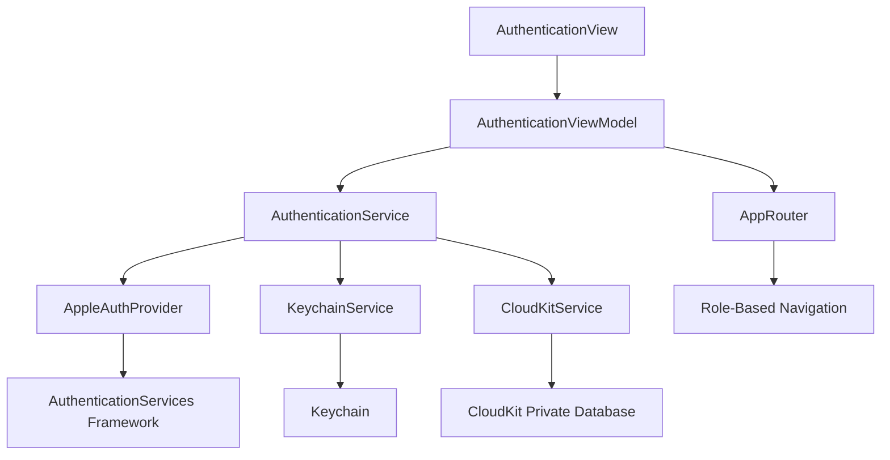
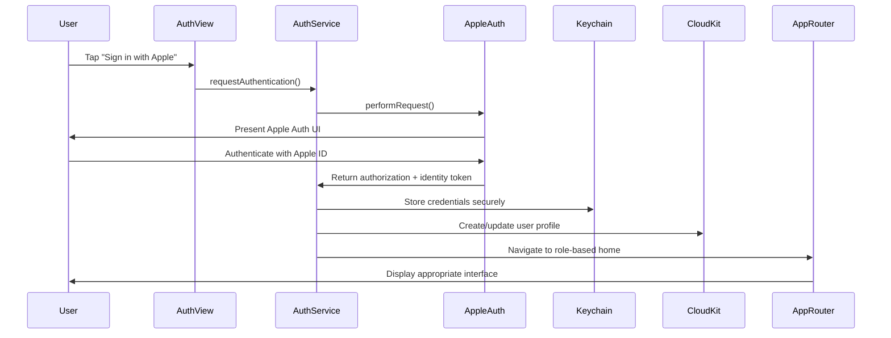

# Apple Authentication Design Document

## Overview

The Apple Authentication system provides secure, privacy-focused authentication for the MimiSupply app using Sign in with Apple. The design follows an "Explore-First" approach where users can browse content without authentication, with login gates only appearing at critical interaction points (checkout, driver mode, partner management).

The system integrates with Apple's AuthenticationServices framework, stores credentials securely in Keychain, and syncs user profiles via CloudKit for cross-device functionality. The architecture supports multiple user roles (Customer, Driver, Partner, Admin) with role-based navigation after authentication.

## Architecture

### High-Level Architecture



### Authentication Flow



## Components and Interfaces

### 1. AuthenticationService Protocol

```swift
protocol AuthenticationService: Sendable {
    var isAuthenticated: Bool { get async }
    var currentUser: UserProfile? { get async }
    
    func signInWithApple() async throws -> AuthenticationResult
    func signOut() async throws
    func refreshCredentials() async throws -> Bool
    func checkAuthenticationState() async -> AuthenticationState
}
```

### 2. UserProfile Model

```swift
struct UserProfile: Codable, Sendable {
    let id: String
    let appleUserID: String
    let email: String?
    let fullName: PersonNameComponents?
    let role: UserRole
    let createdAt: Date
    let lastSignInAt: Date
    
    enum UserRole: String, CaseIterable, Codable {
        case customer
        case driver
        case partner
        case admin
    }
}
```

### 3. AuthenticationResult

```swift
enum AuthenticationResult: Sendable {
    case success(UserProfile)
    case requiresRoleSelection(partialProfile: PartialUserProfile)
    case cancelled
    case failed(AuthenticationError)
}

enum AuthenticationState: Sendable {
    case authenticated(UserProfile)
    case unauthenticated
    case expired
    case unknown
}
```

### 4. KeychainService

```swift
protocol KeychainService: Sendable {
    func store(credentials: AuthCredentials) async throws
    func retrieve() async throws -> AuthCredentials?
    func delete() async throws
    func exists() async -> Bool
}

struct AuthCredentials: Codable {
    let userID: String
    let identityToken: Data
    let authorizationCode: Data?
    let expirationDate: Date
}
```

### 5. AppleAuthProvider

```swift
protocol AppleAuthProvider: Sendable {
    func performSignInRequest() async throws -> ASAuthorizationAppleIDCredential
    func getCredentialState(for userID: String) async throws -> ASAuthorizationAppleIDProvider.CredentialState
}
```

## Data Models

### CloudKit Schema

#### UserProfile Record (Private Database)

```swift
// CloudKit Record Type: "UserProfile"
struct UserProfileRecord {
    static let recordType = "UserProfile"
    
    // Fields
    static let appleUserID = "appleUserID"        // String (Indexed)
    static let email = "email"                    // String (Optional)
    static let fullName = "fullName"              // String (Optional)
    static let role = "role"                      // String
    static let createdAt = "createdAt"            // Date
    static let lastSignInAt = "lastSignInAt"      // Date
    static let isActive = "isActive"              // Int64 (Boolean)
}
```

### Local Storage (CoreData)

```swift
@Model
class CachedUserProfile {
    @Attribute(.unique) var id: String
    var appleUserID: String
    var email: String?
    var fullName: String?
    var role: String
    var createdAt: Date
    var lastSignInAt: Date
    var syncedAt: Date?
    
    init(from profile: UserProfile) {
        // Initialization logic
    }
}
```

## Error Handling

### AuthenticationError Hierarchy

```swift
enum AuthenticationError: LocalizedError, Sendable {
    case userCancelled
    case networkUnavailable
    case invalidCredentials
    case keychainError(KeychainError)
    case cloudKitError(CKError)
    case appleServiceUnavailable
    case tokenExpired
    case roleSelectionRequired
    case unknown(Error)
    
    var errorDescription: String? {
        switch self {
        case .userCancelled:
            return "Authentication was cancelled"
        case .networkUnavailable:
            return "Network connection required for sign in"
        case .invalidCredentials:
            return "Invalid authentication credentials"
        case .keychainError(let error):
            return "Secure storage error: \(error.localizedDescription)"
        case .cloudKitError(let error):
            return "Sync error: \(error.localizedDescription)"
        case .appleServiceUnavailable:
            return "Apple authentication service is temporarily unavailable"
        case .tokenExpired:
            return "Authentication session has expired"
        case .roleSelectionRequired:
            return "Please select your account type"
        case .unknown(let error):
            return "Authentication failed: \(error.localizedDescription)"
        }
    }
}
```

### Error Recovery Strategies

1. **Network Errors**: Retry with exponential backoff, cache credentials locally
2. **Token Expiration**: Automatic refresh attempt, fallback to re-authentication
3. **Keychain Errors**: Clear corrupted data, prompt for re-authentication
4. **CloudKit Errors**: Queue operations for retry, maintain local state
5. **User Cancellation**: Return to previous state without error display

## Testing Strategy

### Unit Tests

```swift
// AuthenticationServiceTests.swift
class AuthenticationServiceTests: XCTestCase {
    func testSuccessfulAuthentication() async throws
    func testAuthenticationCancellation() async throws
    func testCredentialRefresh() async throws
    func testSignOut() async throws
    func testKeychainIntegration() async throws
    func testCloudKitSync() async throws
}

// KeychainServiceTests.swift
class KeychainServiceTests: XCTestCase {
    func testStoreAndRetrieveCredentials() async throws
    func testCredentialDeletion() async throws
    func testKeychainAccessibility() async throws
}
```

### Integration Tests

```swift
// AuthenticationFlowTests.swift
class AuthenticationFlowTests: XCTestCase {
    func testEndToEndAuthenticationFlow() async throws
    func testCrossDeviceSync() async throws
    func testOfflineAuthenticationCheck() async throws
    func testRoleBasedNavigation() async throws
}
```

### UI Tests

```swift
// AuthenticationUITests.swift
class AuthenticationUITests: XCTestCase {
    func testSignInButtonAccessibility() throws
    func testAuthenticationFlowNavigation() throws
    func testErrorStateDisplay() throws
    func testSignOutFlow() throws
    func testDynamicTypeSupport() throws
    func testVoiceOverSupport() throws
}
```

### Accessibility Tests

```swift
// AuthenticationAccessibilityTests.swift
class AuthenticationAccessibilityTests: XCTestCase {
    func testVoiceOverLabels() throws
    func testDynamicTypeScaling() throws
    func testHighContrastSupport() throws
    func testSwitchControlNavigation() throws
    func testReducedMotionSupport() throws
}
```

## Implementation Details

### 1. AuthenticationView (SwiftUI)

```swift
struct AuthenticationView: View {
    @StateObject private var viewModel = AuthenticationViewModel()
    @Environment(\.colorScheme) private var colorScheme
    
    var body: some View {
        VStack(spacing: 32) {
            // App branding and welcome message
            // Sign in with Apple button
            // Privacy information
            // Accessibility support
        }
        .task {
            await viewModel.checkExistingAuthentication()
        }
    }
}
```

### 2. Role Selection Flow

For new users who haven't selected a role:

```swift
struct RoleSelectionView: View {
    let partialProfile: PartialUserProfile
    @StateObject private var viewModel: RoleSelectionViewModel
    
    var body: some View {
        VStack {
            // Role selection cards (Customer, Driver, Partner)
            // Each with clear descriptions and benefits
            // Accessibility labels and VoiceOver support
        }
    }
}
```

### 3. Background Authentication Check

```swift
class AuthenticationService {
    func performBackgroundAuthenticationCheck() async {
        // Check credential validity
        // Refresh if needed
        // Update app state
        // Handle errors gracefully
    }
}
```

### 4. CloudKit Integration

```swift
extension CloudKitService {
    func syncUserProfile(_ profile: UserProfile) async throws {
        let record = CKRecord(recordType: UserProfileRecord.recordType)
        // Map profile to CloudKit record
        // Handle conflicts and merging
        // Implement retry logic
    }
}
```

## Security Considerations

1. **Credential Storage**: Use Keychain with `kSecAttrAccessibleWhenUnlockedThisDeviceOnly`
2. **Token Validation**: Verify Apple identity tokens server-side when possible
3. **Data Minimization**: Store only essential user information
4. **Secure Transport**: All CloudKit operations use encrypted connections
5. **Access Control**: Implement proper CloudKit record permissions
6. **Audit Logging**: Log authentication events for security monitoring

## Performance Considerations

1. **Lazy Loading**: Load user profile data only when needed
2. **Caching**: Cache authentication state and user profile locally
3. **Background Refresh**: Perform credential checks in background
4. **Network Optimization**: Batch CloudKit operations when possible
5. **Memory Management**: Use weak references to prevent retain cycles
6. **Startup Time**: Minimize authentication checks on app launch

## Accessibility Implementation

1. **VoiceOver**: Comprehensive labels and hints for all interactive elements
2. **Dynamic Type**: Support for all text size categories
3. **High Contrast**: Ensure WCAG 2.2 AA compliance
4. **Switch Control**: Proper focus management and navigation
5. **Reduced Motion**: Respect motion preferences in animations
6. **Keyboard Navigation**: Full keyboard accessibility support