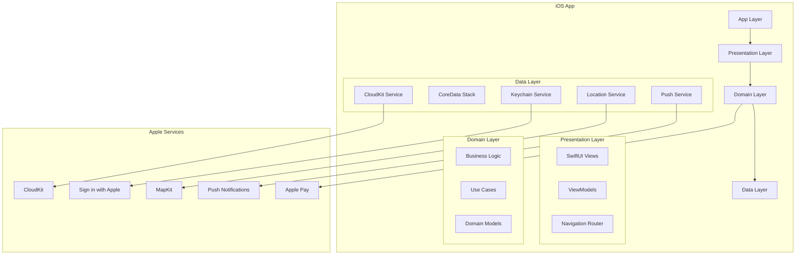

# MimiSupply iOS App - Design Document

## Overview

MimiSupply is a production-grade, three-sided marketplace iOS app built with SwiftUI for iOS 17+. The app connects customers, local businesses, and drivers through an "Explore-First" architecture that prioritizes user experience, accessibility, and performance. The design follows Fortune-33 quality standards with comprehensive CloudKit integration, real-time features, and Apple ecosystem integration.

## Architecture

### High-Level System Architecture



### Modular Architecture

```
MimiSupply/
├── App/                    # App lifecycle, DI container, routing
├── DesignSystem/          # Colors, typography, components
├── Foundation/            # Utilities, extensions, error handling
├── Data/                  # Services, repositories, models
├── Domain/               # Business logic, use cases
├── Features/             # Feature modules
│   ├── Authentication/
│   ├── Explore/
│   ├── Customer/
│   ├── Driver/
│   ├── Partner/
│   └── Shared/
└── Tests/                # Unit, integration, UI tests
```

## Design System

### Color Palette

```swift
// Colors.swift
extension Color {
    // Primary Colors
    static let emerald = Color(hex: "1E9E8B")      // Primary brand
    static let chalk = Color(hex: "F9F9F5")        // Background
    static let graphite = Color(hex: "333333")     // Text primary
    
    // Semantic Colors
    static let success = Color(hex: "10B981")
    static let warning = Color(hex: "F59E0B")
    static let error = Color(hex: "EF4444")
    static let info = Color(hex: "3B82F6")
    
    // Neutral Grays
    static let gray50 = Color(hex: "F9FAFB")
    static let gray100 = Color(hex: "F3F4F6")
    static let gray200 = Color(hex: "E5E7EB")
    static let gray300 = Color(hex: "D1D5DB")
    static let gray400 = Color(hex: "9CA3AF")
    static let gray500 = Color(hex: "6B7280")
    static let gray600 = Color(hex: "4B5563")
    static let gray700 = Color(hex: "374151")
    static let gray800 = Color(hex: "1F2937")
    static let gray900 = Color(hex: "111827")
}
```

### Typography System

```swift
// Typography.swift
extension Font {
    // Display
    static let displayLarge = Font.custom("Inter", size: 57).weight(.regular)
    static let displayMedium = Font.custom("Inter", size: 45).weight(.regular)
    static let displaySmall = Font.custom("Inter", size: 36).weight(.regular)
    
    // Headline
    static let headlineLarge = Font.custom("Inter", size: 32).weight(.regular)
    static let headlineMedium = Font.custom("Inter", size: 28).weight(.regular)
    static let headlineSmall = Font.custom("Inter", size: 24).weight(.regular)
    
    // Title
    static let titleLarge = Font.custom("Inter", size: 22).weight(.medium)
    static let titleMedium = Font.custom("Inter", size: 16).weight(.medium)
    static let titleSmall = Font.custom("Inter", size: 14).weight(.medium)
    
    // Body
    static let bodyLarge = Font.custom("Inter", size: 16).weight(.regular)
    static let bodyMedium = Font.custom("Inter", size: 14).weight(.regular)
    static let bodySmall = Font.custom("Inter", size: 12).weight(.regular)
    
    // Label
    static let labelLarge = Font.custom("Inter", size: 14).weight(.medium)
    static let labelMedium = Font.custom("Inter", size: 12).weight(.medium)
    static let labelSmall = Font.custom("Inter", size: 11).weight(.medium)
}
```

### Spacing System (8pt Grid)

```swift
// Spacing.swift
enum Spacing {
    static let xs: CGFloat = 4      // 0.5 units
    static let sm: CGFloat = 8      // 1 unit
    static let md: CGFloat = 16     // 2 units
    static let lg: CGFloat = 24     // 3 units
    static let xl: CGFloat = 32     // 4 units
    static let xxl: CGFloat = 48    // 6 units
    static let xxxl: CGFloat = 64   // 8 units
}
```

## Data Models

### Core Domain Models

```swift
// User and Authentication
struct UserProfile: Codable, Sendable, Identifiable {
    let id: String
    let appleUserID: String
    let email: String?
    let fullName: PersonNameComponents?
    let role: UserRole
    let phoneNumber: String?
    let profileImageURL: URL?
    let isVerified: Bool
    let createdAt: Date
    let lastActiveAt: Date
}

enum UserRole: String, CaseIterable, Codable {
    case customer
    case driver
    case partner
    case admin
}

// Business and Products
struct Partner: Codable, Sendable, Identifiable {
    let id: String
    let name: String
    let category: PartnerCategory
    let description: String
    let address: Address
    let location: CLLocationCoordinate2D
    let phoneNumber: String
    let email: String
    let heroImageURL: URL?
    let logoURL: URL?
    let isVerified: Bool
    let isActive: Bool
    let rating: Double
    let reviewCount: Int
    let openingHours: [WeekDay: OpeningHours]
    let deliveryRadius: Double // in kilometers
    let minimumOrderAmount: Int // in cents
    let estimatedDeliveryTime: Int // in minutes
    let createdAt: Date
}

enum PartnerCategory: String, CaseIterable, Codable {
    case restaurant
    case pharmacy
    case grocery
    case retail
    case convenience
}

struct Product: Codable, Sendable, Identifiable {
    let id: String
    let partnerId: String
    let name: String
    let description: String
    let priceCents: Int
    let originalPriceCents: Int?
    let category: ProductCategory
    let imageURLs: [URL]
    let isAvailable: Bool
    let stockQuantity: Int?
    let nutritionInfo: NutritionInfo?
    let allergens: [Allergen]
    let tags: [String]
    let weight: Measurement<UnitMass>?
    let dimensions: ProductDimensions?
    let createdAt: Date
    let updatedAt: Date
}

// Orders and Delivery
struct Order: Codable, Sendable, Identifiable {
    let id: String
    let customerId: String
    let partnerId: String
    let driverId: String?
    let items: [OrderItem]
    let status: OrderStatus
    let subtotalCents: Int
    let deliveryFeeCents: Int
    let platformFeeCents: Int
    let taxCents: Int
    let tipCents: Int
    let totalCents: Int
    let deliveryAddress: Address
    let deliveryInstructions: String?
    let estimatedDeliveryTime: Date?
    let actualDeliveryTime: Date?
    let paymentMethod: PaymentMethod
    let paymentStatus: PaymentStatus
    let createdAt: Date
    let updatedAt: Date
}

enum OrderStatus: String, CaseIterable, Codable {
    case created
    case paymentProcessing
    case paymentConfirmed
    case accepted
    case preparing
    case readyForPickup
    case pickedUp
    case delivering
    case delivered
    case cancelled
    case refunded
}

struct OrderItem: Codable, Sendable, Identifiable {
    let id: String
    let productId: String
    let productName: String
    let quantity: Int
    let unitPriceCents: Int
    let totalPriceCents: Int
    let specialInstructions: String?
}

// Driver and Location
struct Driver: Codable, Sendable, Identifiable {
    let id: String
    let userId: String
    let vehicleType: VehicleType
    let licensePlate: String
    let isOnline: Bool
    let isAvailable: Bool
    let currentLocation: CLLocationCoordinate2D?
    let rating: Double
    let completedDeliveries: Int
    let verificationStatus: VerificationStatus
    let createdAt: Date
}

struct DriverLocation: Codable, Sendable {
    let driverId: String
    let location: CLLocationCoordinate2D
    let heading: Double?
    let speed: Double?
    let accuracy: Double
    let timestamp: Date
}

enum VehicleType: String, CaseIterable, Codable {
    case bicycle
    case scooter
    case motorcycle
    case car
    case van
}
```

### CloudKit Schema

```swift
// CloudKit Record Types and Field Names
enum CloudKitSchema {
    // Public Database
    enum Partner {
        static let recordType = "Partner"
        static let name = "name"
        static let category = "category"
        static let address = "address"
        static let latitude = "latitude"
        static let longitude = "longitude"
        static let isVerified = "isVerified"
        static let isActive = "isActive"
        static let rating = "rating"
        static let heroImage = "heroImage"
    }
    
    enum Product {
        static let recordType = "Product"
        static let partnerId = "partnerId"
        static let name = "name"
        static let priceCents = "priceCents"
        static let category = "category"
        static let isAvailable = "isAvailable"
        static let images = "images"
    }
    
    // Private Database
    enum UserProfile {
        static let recordType = "UserProfile"
        static let appleUserID = "appleUserID"
        static let role = "role"
        static let email = "email"
        static let fullName = "fullName"
    }
    
    enum Order {
        static let recordType = "Order"
        static let customerId = "customerId"
        static let partnerId = "partnerId"
        static let status = "status"
        static let totalCents = "totalCents"
        static let items = "items"
    }
    
    enum DriverLocation {
        static let recordType = "DriverLocation"
        static let driverId = "driverId"
        static let latitude = "latitude"
        static let longitude = "longitude"
        static let timestamp = "timestamp"
    }
}
```

## Components and Interfaces

### Core Services

```swift
// Authentication Service
protocol AuthenticationService: Sendable {
    var isAuthenticated: Bool { get async }
    var currentUser: UserProfile? { get async }
    
    func signInWithApple() async throws -> AuthenticationResult
    func signOut() async throws
    func refreshCredentials() async throws -> Bool
}

// CloudKit Service
protocol CloudKitService: Sendable {
    func fetchPartners(in region: MKCoordinateRegion) async throws -> [Partner]
    func fetchProducts(for partnerId: String) async throws -> [Product]
    func createOrder(_ order: Order) async throws -> Order
    func updateOrderStatus(_ orderId: String, status: OrderStatus) async throws
    func subscribeToOrderUpdates(for userId: String) async throws
}

// Location Service
protocol LocationService: Sendable {
    var currentLocation: CLLocation? { get async }
    var authorizationStatus: CLAuthorizationStatus { get }
    
    func requestLocationPermission() async throws
    func startLocationUpdates() async throws
    func stopLocationUpdates()
    func startBackgroundLocationUpdates() async throws
}

// Payment Service
protocol PaymentService: Sendable {
    func processPayment(for order: Order) async throws -> PaymentResult
    func refundPayment(for orderId: String, amount: Int) async throws
    func validateMerchantCapability() -> Bool
}

// Push Notification Service
protocol PushNotificationService: Sendable {
    func requestPermission() async throws -> Bool
    func registerForRemoteNotifications() async throws
    func handleNotification(_ notification: UNNotification) async
}
```

### UI Components

```swift
// Primary Button Component
struct PrimaryButton: View {
    let title: String
    let action: () -> Void
    let isLoading: Bool
    let isDisabled: Bool
    
    var body: some View {
        Button(action: action) {
            HStack {
                if isLoading {
                    ProgressView()
                        .progressViewStyle(CircularProgressViewStyle(tint: .white))
                        .scaleEffect(0.8)
                }
                Text(title)
                    .font(.labelLarge)
                    .foregroundColor(.white)
            }
            .frame(maxWidth: .infinity)
            .frame(height: 44)
            .background(isDisabled ? Color.gray400 : Color.emerald)
            .cornerRadius(8)
        }
        .disabled(isDisabled || isLoading)
        .accessibilityLabel(title)
        .accessibilityHint(isLoading ? "Loading" : "")
    }
}

// Partner Card Component
struct PartnerCard: View {
    let partner: Partner
    let onTap: () -> Void
    
    var body: some View {
        Button(action: onTap) {
            VStack(alignment: .leading, spacing: Spacing.sm) {
                AsyncImage(url: partner.heroImageURL) { image in
                    image
                        .resizable()
                        .aspectRatio(contentMode: .fill)
                } placeholder: {
                    Rectangle()
                        .fill(Color.gray200)
                        .overlay(
                            Image(systemName: "photo")
                                .foregroundColor(.gray400)
                        )
                }
                .frame(height: 120)
                .clipped()
                .cornerRadius(8)
                
                VStack(alignment: .leading, spacing: Spacing.xs) {
                    Text(partner.name)
                        .font(.titleMedium)
                        .foregroundColor(.graphite)
                        .lineLimit(1)
                    
                    Text(partner.category.rawValue.capitalized)
                        .font(.bodySmall)
                        .foregroundColor(.gray600)
                    
                    HStack {
                        Image(systemName: "star.fill")
                            .foregroundColor(.warning)
                            .font(.caption)
                        Text(String(format: "%.1f", partner.rating))
                            .font(.bodySmall)
                            .foregroundColor(.gray600)
                        Text("(\(partner.reviewCount))")
                            .font(.bodySmall)
                            .foregroundColor(.gray500)
                        Spacer()
                        Text("\(partner.estimatedDeliveryTime) min")
                            .font(.bodySmall)
                            .foregroundColor(.gray600)
                    }
                }
                .padding(.horizontal, Spacing.sm)
                .padding(.bottom, Spacing.sm)
            }
        }
        .background(Color.white)
        .cornerRadius(12)
        .shadow(color: .black.opacity(0.1), radius: 4, x: 0, y: 2)
        .accessibilityLabel("\(partner.name), \(partner.category.rawValue), \(partner.rating) stars, \(partner.estimatedDeliveryTime) minutes delivery")
    }
}

// Product Row Component
struct ProductRow: View {
    let product: Product
    let onAddToCart: () -> Void
    
    var body: some View {
        HStack(spacing: Spacing.md) {
            AsyncImage(url: product.imageURLs.first) { image in
                image
                    .resizable()
                    .aspectRatio(contentMode: .fill)
            } placeholder: {
                Rectangle()
                    .fill(Color.gray200)
            }
            .frame(width: 80, height: 80)
            .cornerRadius(8)
            
            VStack(alignment: .leading, spacing: Spacing.xs) {
                Text(product.name)
                    .font(.titleSmall)
                    .foregroundColor(.graphite)
                    .lineLimit(2)
                
                Text(product.description)
                    .font(.bodySmall)
                    .foregroundColor(.gray600)
                    .lineLimit(2)
                
                Spacer()
                
                HStack {
                    PriceTag(priceCents: product.priceCents, 
                            originalPriceCents: product.originalPriceCents)
                    
                    Spacer()
                    
                    Button(action: onAddToCart) {
                        Image(systemName: "plus.circle.fill")
                            .foregroundColor(.emerald)
                            .font(.title2)
                    }
                    .accessibilityLabel("Add \(product.name) to cart")
                }
            }
            
            Spacer()
        }
        .padding(.vertical, Spacing.sm)
    }
}
```

## Screen Designs

### 1. ExploreHomeView (Landing Screen)

```swift
struct ExploreHomeView: View {
    @StateObject private var viewModel = ExploreHomeViewModel()
    @State private var showingMap = false
    
    var body: some View {
        NavigationStack {
            VStack(spacing: 0) {
                // Header with search and toggle
                AppHeader(
                    searchText: $viewModel.searchText,
                    showingMap: $showingMap,
                    cartItemCount: viewModel.cartItemCount
                )
                
                if showingMap {
                    MapView(partners: viewModel.partners)
                } else {
                    ScrollView {
                        LazyVStack(spacing: Spacing.md) {
                            // Featured carousel
                            FeaturedPartnersCarousel(partners: viewModel.featuredPartners)
                            
                            // Categories
                            CategoryGrid(categories: viewModel.categories)
                            
                            // Partner list
                            ForEach(viewModel.partners) { partner in
                                PartnerCard(partner: partner) {
                                    viewModel.selectPartner(partner)
                                }
                            }
                        }
                        .padding(.horizontal, Spacing.md)
                    }
                }
            }
        }
        .task {
            await viewModel.loadInitialData()
        }
    }
}
```

### 2. PartnerDetailView

```swift
struct PartnerDetailView: View {
    let partner: Partner
    @StateObject private var viewModel: PartnerDetailViewModel
    
    init(partner: Partner) {
        self.partner = partner
        self._viewModel = StateObject(wrappedValue: PartnerDetailViewModel(partner: partner))
    }
    
    var body: some View {
        ScrollView {
            VStack(alignment: .leading, spacing: Spacing.lg) {
                // Hero image and basic info
                PartnerHeroSection(partner: partner)
                
                // Menu categories
                CategoryTabs(
                    categories: viewModel.productCategories,
                    selectedCategory: $viewModel.selectedCategory
                )
                
                // Products list
                LazyVStack(spacing: Spacing.sm) {
                    ForEach(viewModel.filteredProducts) { product in
                        ProductRow(product: product) {
                            viewModel.addToCart(product)
                        }
                        Divider()
                    }
                }
                .padding(.horizontal, Spacing.md)
            }
        }
        .navigationBarTitleDisplayMode(.inline)
        .toolbar {
            ToolbarItem(placement: .navigationBarTrailing) {
                CartButton(itemCount: viewModel.cartItemCount)
            }
        }
    }
}
```

### 3. CartView and Checkout

```swift
struct CartView: View {
    @StateObject private var viewModel = CartViewModel()
    @State private var showingCheckout = false
    
    var body: some View {
        NavigationStack {
            VStack {
                if viewModel.cartItems.isEmpty {
                    EmptyCartView()
                } else {
                    ScrollView {
                        LazyVStack(spacing: Spacing.sm) {
                            ForEach(viewModel.cartItems) { item in
                                CartItemRow(
                                    item: item,
                                    onQuantityChange: viewModel.updateQuantity,
                                    onRemove: viewModel.removeItem
                                )
                            }
                        }
                        .padding(.horizontal, Spacing.md)
                    }
                    
                    // Price breakdown
                    OrderSummaryView(
                        subtotal: viewModel.subtotal,
                        deliveryFee: viewModel.deliveryFee,
                        platformFee: viewModel.platformFee,
                        tax: viewModel.tax,
                        total: viewModel.total
                    )
                    
                    PrimaryButton(
                        title: "Proceed to Checkout",
                        action: { showingCheckout = true },
                        isLoading: false,
                        isDisabled: viewModel.cartItems.isEmpty
                    )
                    .padding(.horizontal, Spacing.md)
                }
            }
            .navigationTitle("Cart")
            .sheet(isPresented: $showingCheckout) {
                CheckoutView(cartItems: viewModel.cartItems)
            }
        }
    }
}
```

### 4. Driver Dashboard

```swift
struct DriverDashboardView: View {
    @StateObject private var viewModel = DriverDashboardViewModel()
    
    var body: some View {
        NavigationStack {
            VStack(spacing: Spacing.lg) {
                // Status toggle
                DriverStatusToggle(
                    isOnline: viewModel.isOnline,
                    isAvailable: viewModel.isAvailable,
                    onToggleOnline: viewModel.toggleOnlineStatus,
                    onToggleAvailable: viewModel.toggleAvailability
                )
                
                // Earnings summary
                EarningsSummaryCard(
                    todayEarnings: viewModel.todayEarnings,
                    weekEarnings: viewModel.weekEarnings,
                    completedDeliveries: viewModel.completedDeliveries
                )
                
                // Available jobs or current delivery
                if let currentDelivery = viewModel.currentDelivery {
                    CurrentDeliveryCard(delivery: currentDelivery)
                } else {
                    AvailableJobsList(
                        jobs: viewModel.availableJobs,
                        onAcceptJob: viewModel.acceptJob
                    )
                }
                
                Spacer()
            }
            .padding(.horizontal, Spacing.md)
            .navigationTitle("Driver Dashboard")
        }
        .task {
            await viewModel.initialize()
        }
    }
}
```

### 5. Partner Dashboard

```swift
struct PartnerDashboardView: View {
    @StateObject private var viewModel = PartnerDashboardViewModel()
    
    var body: some View {
        NavigationStack {
            ScrollView {
                VStack(spacing: Spacing.lg) {
                    // Business stats
                    BusinessStatsCard(
                        todayOrders: viewModel.todayOrders,
                        revenue: viewModel.todayRevenue,
                        rating: viewModel.averageRating
                    )
                    
                    // Pending orders
                    PendingOrdersList(
                        orders: viewModel.pendingOrders,
                        onUpdateStatus: viewModel.updateOrderStatus
                    )
                    
                    // Quick actions
                    QuickActionsGrid(
                        onManageProducts: viewModel.navigateToProducts,
                        onViewAnalytics: viewModel.navigateToAnalytics,
                        onUpdateHours: viewModel.navigateToHours
                    )
                }
                .padding(.horizontal, Spacing.md)
            }
            .navigationTitle("Partner Dashboard")
            .toolbar {
                ToolbarItem(placement: .navigationBarTrailing) {
                    Button("Settings") {
                        viewModel.navigateToSettings()
                    }
                }
            }
        }
    }
}
```

## Error Handling

### Comprehensive Error System

```swift
enum AppError: LocalizedError, Sendable {
    case authentication(AuthenticationError)
    case network(NetworkError)
    case cloudKit(CKError)
    case location(LocationError)
    case payment(PaymentError)
    case validation(ValidationError)
    case unknown(Error)
    
    var errorDescription: String? {
        switch self {
        case .authentication(let error):
            return error.localizedDescription
        case .network(let error):
            return error.localizedDescription
        case .cloudKit(let error):
            return "Sync error: \(error.localizedDescription)"
        case .location(let error):
            return "Location error: \(error.localizedDescription)"
        case .payment(let error):
            return "Payment error: \(error.localizedDescription)"
        case .validation(let error):
            return error.localizedDescription
        case .unknown(let error):
            return "An unexpected error occurred: \(error.localizedDescription)"
        }
    }
    
    var recoverySuggestion: String? {
        switch self {
        case .network:
            return "Please check your internet connection and try again."
        case .cloudKit:
            return "Your data will sync when connection is restored."
        case .location:
            return "Please enable location services in Settings."
        case .payment:
            return "Please check your payment method and try again."
        default:
            return "Please try again or contact support if the problem persists."
        }
    }
}
```

## Testing Strategy

### Test Architecture

```swift
// Unit Tests
class ExploreHomeViewModelTests: XCTestCase {
    func testLoadInitialData() async throws
    func testSearchFunctionality() async throws
    func testPartnerFiltering() async throws
    func testCartIntegration() async throws
}

// Integration Tests
class OrderFlowIntegrationTests: XCTestCase {
    func testCompleteOrderFlow() async throws
    func testPaymentProcessing() async throws
    func testDriverAssignment() async throws
    func testRealTimeUpdates() async throws
}

// UI Tests
class AccessibilityUITests: XCTestCase {
    func testVoiceOverNavigation() throws
    func testDynamicTypeSupport() throws
    func testHighContrastMode() throws
    func testKeyboardNavigation() throws
}

// Performance Tests
class PerformanceTests: XCTestCase {
    func testAppLaunchTime() throws
    func testScrollingPerformance() throws
    func testImageLoadingPerformance() throws
    func testMemoryUsage() throws
}
```

## Performance Optimizations

### Image Caching and Loading

```swift
class ImageCache: ObservableObject {
    private let cache = NSCache<NSString, UIImage>()
    private let fileManager = FileManager.default
    
    func loadImage(from url: URL) async -> UIImage? {
        // Memory cache check
        if let cachedImage = cache.object(forKey: url.absoluteString as NSString) {
            return cachedImage
        }
        
        // Disk cache check
        if let diskImage = loadFromDisk(url: url) {
            cache.setObject(diskImage, forKey: url.absoluteString as NSString)
            return diskImage
        }
        
        // Network fetch
        do {
            let (data, _) = try await URLSession.shared.data(from: url)
            guard let image = UIImage(data: data) else { return nil }
            
            // Cache in memory and disk
            cache.setObject(image, forKey: url.absoluteString as NSString)
            saveToDisk(image: image, url: url)
            
            return image
        } catch {
            return nil
        }
    }
}
```

### Background Task Management

```swift
class BackgroundTaskManager {
    func scheduleLocationUpdates() {
        let request = BGAppRefreshTaskRequest(identifier: "com.mimisupply.location-update")
        request.earliestBeginDate = Date(timeIntervalSinceNow: 10)
        
        try? BGTaskScheduler.shared.submit(request)
    }
    
    func handleBackgroundLocationUpdate(task: BGAppRefreshTask) {
        task.expirationHandler = {
            task.setTaskCompleted(success: false)
        }
        
        Task {
            await LocationService.shared.updateDriverLocation()
            task.setTaskCompleted(success: true)
        }
    }
}
```

## Security and Privacy

### Data Protection

```swift
class SecureStorage {
    private let keychain = Keychain(service: "com.mimisupply.app")
    
    func store<T: Codable>(_ value: T, for key: String) throws {
        let data = try JSONEncoder().encode(value)
        try keychain
            .accessibility(.whenUnlockedThisDeviceOnly)
            .set(data, key: key)
    }
    
    func retrieve<T: Codable>(_ type: T.Type, for key: String) throws -> T? {
        guard let data = try keychain.getData(key) else { return nil }
        return try JSONDecoder().decode(type, from: data)
    }
}
```

### Privacy Compliance

```swift
class PrivacyManager {
    func requestTrackingPermission() async -> Bool {
        guard #available(iOS 14, *) else { return false }
        
        let status = await ATTrackingManager.requestTrackingAuthorization()
        return status == .authorized
    }
    
    func logAnalyticsEvent(_ event: AnalyticsEvent) {
        // Only log non-PII data
        guard event.containsNoPII else { return }
        
        Analytics.shared.log(event)
    }
}
```

This comprehensive design document covers all aspects needed for a production-ready iOS app. The architecture is scalable, maintainable, and follows Apple's best practices while ensuring accessibility, performance, and security standards are met.