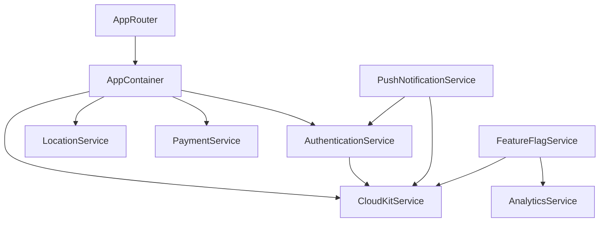

# MimiSupply - Systemarchitektur-Dokumentation

## Überblick

MimiSupply ist eine iOS-basierte Lieferservice-Plattform, die drei Hauptbenutzerrollen unterstützt: **Customer** (Kunde), **Driver** (Fahrer) und **Partner** (Geschäftspartner). Die App ermöglicht es Kunden, Produkte von lokalen Partnern zu bestellen, während Fahrer die Lieferungen durchführen.

### Technische Spezifikationen
- **Plattform**: iOS 17.0+
- **Framework**: SwiftUI
- **Architektur**: MVVM (Model-View-ViewModel)
- **Backend**: CloudKit (Apple)
- **Lokale Persistierung**: CoreData
- **Dependency Injection**: AppContainer Pattern
- **Navigation**: Custom AppRouter

## Architektur-Komponenten

### 1. App-Schicht (App Layer)

#### AppContainer
- **Zweck**: Zentrales Dependency Injection System
- **Verantwortlichkeiten**:
  - Service-Initialisierung und -Verwaltung
  - Singleton-Pattern für geteilte Services
  - CloudKit-Subscriptions Setup

```swift
@MainActor
final class AppContainer: ObservableObject {
    // Core Services
    let appState: AppState
    let analytics: AnalyticsService
    let authenticationService: AuthenticationService
    let cloudKitService: CloudKitService
    let pushNotificationService: PushNotificationService
    // ... weitere Services
}
```

#### AppRouter
- **Zweck**: Zentrale Navigation und Deep Linking
- **Features**:
  - Tab-basierte Navigation
  - Deep Link Handling
  - Universal Links
  - Navigation State Persistence
  - Rollenbasierte Navigation

### 2. Daten-Schicht (Data Layer)

#### Datenmodelle

**Hauptentitäten:**
- `UserProfile`: Benutzerprofile mit rollenspezifischen Daten
- `Partner`: Geschäftspartner mit Kategorien und Öffnungszeiten
- `Product`: Produkte mit Kategorien und Preisen
- `Order`: Bestellungen mit Status-Tracking
- `Driver`: Fahrer mit Fahrzeugdaten und Verfügbarkeit

#### Services

**CloudKit Service**
- Synchronisation zwischen lokalen und Cloud-Daten
- Offline-First Architektur
- Conflict Resolution
- Real-time Subscriptions

**Authentication Service**
- Sign in with Apple Integration
- Rollenbasierte Authentifizierung
- Token Management

**Location Service**
- GPS-Tracking für Fahrer
- Lieferradius-Berechnung
- Google Places API Integration

### 3. Business Logic Layer

#### Core Services

**Order Management**
- Bestellprozess-Orchestrierung
- Status-Updates
- Payment Processing
- Delivery Tracking

**Driver Assignment**
- Automatische Fahrer-Zuweisung
- Optimierte Routen-Berechnung
- Verfügbarkeits-Management

**Analytics Service**
- Event Tracking
- Performance Monitoring
- Business Intelligence

### 4. Presentation Layer (SwiftUI)

#### Feature-Module
```
Features/
├── Explore/          # Produktsuche und -entdeckung
├── Authentication/   # Login und Registrierung
├── Orders/          # Bestellverwaltung
├── Profile/         # Benutzerprofil
├── Dashboard/       # Rollenspezifische Dashboards
└── Shared/          # Geteilte UI-Komponenten
```

#### Design System
```
DesignSystem/
├── Colors/          # Farbpalette
├── Typography/      # Schriftarten
├── Components/      # Wiederverwendbare UI-Komponenten
├── Advanced/        # Komplexe UI-Patterns
└── Accessibility/   # Barrierefreiheit
```

## Datenfluss-Architektur

### 1. Offline-First Approach
```
User Action → Local CoreData → Background Sync → CloudKit → Other Devices
```

### 2. Real-time Updates
```
CloudKit Subscription → Push Notification → Local Update → UI Refresh
```

### 3. Conflict Resolution
- Last-Write-Wins für einfache Felder
- Custom Merge Logic für komplexe Objekte
- User-Intervention bei kritischen Konflikten

## Service-Abhängigkeiten



## Skalierbarkeit und Performance

### Performance-Optimierungen
- **StartupOptimizer**: App-Start-Beschleunigung
- **MemoryManager**: Speicher-Management
- **Image Caching**: Effiziente Bild-Verwaltung
- **Background Tasks**: Hintergrund-Synchronisation

### Graceful Degradation
- Offline-Modus mit eingeschränkter Funktionalität
- Fallback-Mechanismen bei Service-Ausfällen
- Progressive Enhancement basierend auf Netzwerk-Qualität

## Sicherheitsarchitektur

### Authentifizierung
- Sign in with Apple (OAuth 2.0)
- Biometrische Authentifizierung
- Token-basierte Session-Verwaltung

### Datenschutz
- End-to-End Verschlüsselung für sensible Daten
- CloudKit Private Database für Benutzerdaten
- DSGVO-konforme Datenverarbeitung

### API-Sicherheit
- Certificate Pinning
- Request Signing
- Rate Limiting

## Monitoring und Logging

### Analytics
- Custom Event Tracking
- Performance Metriken
- Crash Reporting
- User Journey Analysis

### Logging
- Strukturiertes Logging
- Log-Level Management
- Remote Logging für Production

## Deployment-Architektur

### Umgebungen
- **Development**: Lokale Entwicklung
- **Staging**: QA und Testing
- **Production**: Live-App im App Store

### CI/CD Pipeline
- Automated Testing
- Code Quality Checks
- Automated Deployment
- Feature Flag Management

## Externe Abhängigkeiten

### APIs
- **CloudKit**: Backend-as-a-Service
- **Google Places**: Adress-Suche und -Validierung
- **Apple Maps**: Kartendarstellung
- **StoreKit**: In-App Purchases

### Third-Party Libraries
- Minimale externe Abhängigkeiten
- Bevorzugung von Apple-nativen Lösungen
- Regelmäßige Dependency-Updates

## Zukunftige Erweiterungen

### Geplante Features
- Multi-Tenant Architektur
- Machine Learning für Empfehlungen
- Erweiterte Analytics
- Internationale Expansion

### Technische Roadmap
- SwiftUI 6.0 Migration
- iOS 18 Features
- watchOS App
- macOS Catalyst App
